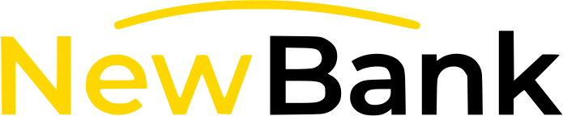

    

<h1 align="center">Redondeo Solidario</h1>

Landing page profesional para la aplicación de **NewBank**, la herramienta de **redondeo solidario**. Convierte los céntimos de tus compras en ayuda real para quienes más lo necesitan.

---

## 🚀 ¿Qué es NewBank?

Newbank es una iniciativa que permite a los usuarios donar automáticamente los céntimos de cada compra a causas sociales y ONGs verificadas. Con cada pago, el importe se redondea al euro superior y la diferencia se acumula en una "hucha solidaria" que se dona periódicamente.

---

## ✨ Características de la landing

- **Diseño moderno y responsive**: Adaptado a cualquier dispositivo, con modo claro/oscuro y paleta de colores coherente con la marca.
- **Mockup profesional**: Presentación visual atractiva de la app en la cabecera.
- **Explicación clara del funcionamiento**: Secciones de pasos, beneficios, causas, seguridad y FAQ.
- **Carrusel de causas**: Navegación automática y fluida por las causas apoyadas.
- **Accesibilidad**: Contrastes, tipografía y navegación optimizados para todos los usuarios.
- **CTA destacado**: Invitación a probar el prototipo interactivo en Figma.

---

## 🖥️ Vista previa

Puedes ver la web oficial aquí:

👉 [NewBank](alejo9am.github.io/newbank)

Puedes ver el prototipo interactivo de la app aquí:

👉 [Probar prototipo en Figma](https://www.figma.com/proto/DgPHiMxVvGbTsgxPmg7nqM/Trabajo-IPO-2?node-id=2-2502&p=f&t=yDCPUxVl4E3HW1Z4-1&scaling=scale-down&content-scaling=fixed&page-id=0%3A1&starting-point-node-id=2%3A2502)

---

## 🌈 Temas y personalización

- **Modo oscuro**: Predeterminado, con fondo oscuro y acentos amarillos.
- **Modo claro**: Alternativo, con fondo cálido, cards blancas y detalles en amarillo.
- **Cambio de tema**: Botón flotante para alternar entre modos, con preferencia guardada.

---

## 👨‍💻 Desarrollo y tecnologías

- **HTML5 + CSS3 (Flexbox, Grid, variables CSS)**
- **JavaScript ES6** (sin frameworks)
- **SVG** para el logo y mockups
- **Accesibilidad**: Navegación por teclado, contraste, responsive

---

## 🤝 Contacto y agradecimientos

- Desarrollador web: [Alejo Arenas Moreira](https://www.linkedin.com/in/alejoarenas)
- Diseño de prototipo: [Lucian Andrei Negoita](https://lucianandreinegoita.dev/en/)
- Documentación: Juan Carlos Toboso Blázquez y Miguel Ángel Ballesteros Perona
- Inspiración: usuarios y ONGs que hacen posible el cambio

---

¡Gracias por visitar y apoyar Redondeo Solidario! 💛
